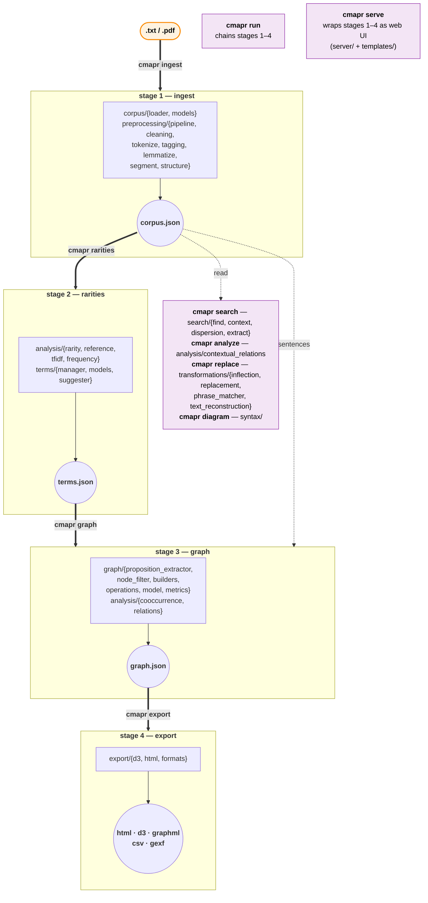

# Architecture

A map of the pipeline stages, the modules that implement each stage, and the CLI commands that drive them. Use this when you need to know *where* to extend the system (new edge types, new export format, new spaCy plumbing, etc.).

## Pipeline diagram

## Stages

### Stage 1 — `cmapr ingest`

Source text → `ProcessedDocument` JSON.

- `corpus/loader.py` — reads `.txt` or `.pdf` (auto-detected; PDF via `pdfplumber`).
- `preprocessing/pipeline.py` — orchestrates the stages below.
- `preprocessing/cleaning.py` — OCR/PDF artifact cleanup (`--clean-ocr`).
- `preprocessing/tokenize.py`, `tagging.py`, `lemmatize.py` — NLTK tokenization, POS, lemmatization.
- `preprocessing/segment.py` — paragraph boundary detection.
- `preprocessing/structure.py` — chapter/section detection (TOC-guided when `--toc` is supplied).
- `preprocessing/pipeline.py` (cont.) — optional spaCy noun-chunk extraction stored on `metadata["noun_chunks"]` (`--spacy`).

### Stage 2 — `cmapr rarities`

Corpus → scored `TermList`.

- `analysis/rarity.py` — `PhilosophicalTermScorer`: 5-signal hybrid (corpus-vs-Brown ratio, TF-IDF, neologism, definitional-context, capitalization).
- `analysis/reference.py`, `tfidf.py`, `frequency.py` — supporting scorers.
- `terms/manager.py`, `terms/models.py` — `TermList` data model and JSON I/O.
- `terms/suggester.py` — auto-populates examples/POS for suggested terms.
- CLI flags: `--top-n`, `--pos`, `--by-section`, `--vet` (interactive prompt; saves to `vetting.json`).

### Stage 3 — `cmapr graph`

Term list + corpus sentences → typed `ConceptGraph`.

- `graph/proposition_extractor.py` — `PropositionExtractor`: regex pattern extractors (definition, kind-of, production, dependence, opposition, property, relation) + composition pattern + POS-based catch-all.
- `graph/node_filter.py` — `NodeFilter`: inclusion criteria (POS, length, frequency, fragment); multi-word phrases bypass single-token guards.
- `graph/builders.py` — `build_proposition_graph`: pair iteration, PMI fallback, edge merging.
- `graph/operations.py` — `prune_to_ratio`, ego-graph slicing for `--focus` / `--depth`.
- `graph/model.py` — `ConceptGraph` (NetworkX wrapper).
- `analysis/cooccurrence.py`, `relations.py` — supplementary signals used by alternative graph builders.

### Stage 4 — `cmapr export`

Graph → renderable artifact.

- `export/d3.py` — `to_d3_dict`: D3 force-directed JSON (defaults).
- `export/html.py` — standalone interactive HTML (D3 force layout, type-filter checkboxes, node detail panel, expand/collapse).
- `export/formats.py` — GraphML, CSV, GEXF.

## Aggregators and wrappers

- **`cmapr run`** — chains stages 1–4 in one invocation. Same logic as the four commands; not a separate code path.
- **`cmapr merge`** — `aggregate_graphs()` in `graph/operations.py` combines two or more graph files: frequencies sum, scores are frequency-weighted means, edges with same-pair-different-type collapse to a single edge that carries additive multi-type fields (`relation_types`, `weight_by_type`, `evidence_by_type`, `verb_by_type`).
- **`cmapr cluster`** — `cluster_by_structure()` in `graph/operations.py` builds one sub-graph per chapter (or section) from a single corpus's `sentence_locations`, namespaces nodes as `<term>__<chapter>`, and adds `recurrence` edges between consecutive same-term occurrences across chapters. The HTML viz auto-detects cluster membership and adds a D3 cluster force.
- **`cmapr serve`** — local web UI (FastAPI + Jinja2). Serves the same stages through the browser; lives under `server/` and `server/templates/`. Requires `pip install 'concept-mapper[serve]'`.

## Auxiliary commands

These read existing artifacts (or operate on raw text) and don't feed back into the pipeline.

| Command | Purpose | Modules |
|---|---|---|
| `cmapr search` | Find sentences containing a term, with context window and dispersion | `search/find.py`, `context.py`, `dispersion.py`, `extract.py` |
| `cmapr analyze` | Contextual relation analysis around one term | `analysis/contextual_relations.py` |
| `cmapr replace` | Synonym replacement preserving inflection | `transformations/inflection.py`, `replacement.py`, `phrase_matcher.py`, `text_reconstruction.py` |
| `cmapr diagram` | Render dependency parse tree (Stanza) | `syntax/` |

## Cross-cutting

- `validation.py` — schema validation called by `ingest`, `rarities`, `graph`.
- `storage/` — JSON-backed `StorageBackend` ABC; designed for future SQLite/Parquet swaps.
- `cli.py` — Click entrypoint. Each subcommand is a thin shell that loads inputs, calls into `*/`, and writes outputs. Logic should not live here (see `.claude/rules.md` § Architecture).
